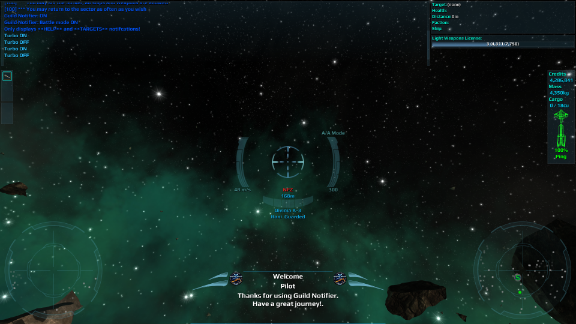
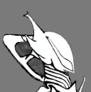

# GuildNotifier
An Unofficial plugin for [__Vendetta Online__](https://www.vendetta-online.com/).

___GuildNotifier___ displays a `HUD` notification for your incoming messages.

Created by _Otesten Vanar_, a member of [__U.S.D.S.__](https://www.vendetta-online.com/x/guildinfo/551/ "Union of the Saving Darkness in the Stars").

## Features:
- Shows notifications for your incoming messages from guild's members, groups or private messages.
- Guild icon blinks when a guild member joins or is added.
- Send help messages and target information.
- Plays a sound with your notification.
- Provides an AUTOLOGIN function.

## Download, install and support.
To install the plugin follow the instructions [Vendetta Wiki](https://www.vo-wiki.com/wiki/Plug-ins). 
To download, share comments, ideas or ask for help follow the [links](#Links) at the bottom of this document. 

## Usage:
| Command       |                               |
|---------------|-------------------------------|
| /gn           | Show options              |
| /gn on        | Enable notifications          |
| /gn off       | Disable notifications         |
| /gn info      | Show info about this plugin   |
| /gn sound     | Just sound notifications      |
| /gn battle    | Battle mode notifications     |
| /gn vol       | Adjust or mute the volume     |
| /gn test      | Send test notifications       |

## Battle mode and  sound mode.
In battle mode you will only see `HELP` and `TARGET` notifications. a "HELP" message will be sent automatically when you got hit and your health is lower than 50%. A message with "target's" info will be sent when you press key "0" or when you use `gn_target` command.  
Sound mode hides the gui and just plays a sound when you receive notifications.

## About config and media files.
To disable notifications (permanently) or disable AUTOLOGIN and other settings, edit `config.lua`. Supported files extensions for icons are `*.jpg` and `*.png` and dimensions of _128x128_ or _64x64_; for sounds use `*.wav` or `*.ogg`.   

NOTE: Sounds need to be encoded to 44100 Hz, stereo, s16, 1411 kb/s

## Disclaimer.
___GuildNotifier___  works only on the client side. The plugin does not share any kind of user data or information with other players.

## License.
> [MIT](./LICENSE)

## Author
> _Otesten Vanar_ ([wilop](https://github.com/wilop))

## Credits:
> _Commander Azryayix Gyarz_: 
- Original guild icon.  
 
 
> [MixKit](https://mixkit.co/free-sound-effects/):  
- Sound Effect "help" (Technology computer calculations).  
- Sound Effect "group" (Retro game notification).  
- Sound Effect "guild" (Technology notification).  
- Sound Effect "private" (​High tech ​bleep ​confirmation).  
- Sound Effect "target" (Sci-fi confirmation).  
- Sound Effect "zoom" (Alien technology button).  

----

## Links
| [Download](https://github.com/wilop/guild-notifier/releases) | [Discussions](https://github.com/wilop/guild-notifier/discussions) | [Issues](https://github.com/wilop/guild-notifier/issues) |
|-----------------|-----------------|-----------------|
|Download here | Share ideas or make questions | Report issues |
